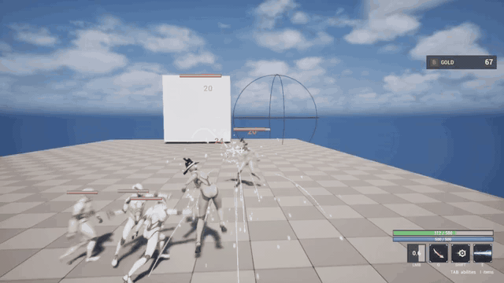

# Moba Prototype

I've always wanted to make a 3D multiplayer MOBA. I spent years poking at it in Blueprint. This is the C++ prototype of that idea, written so I could play it with friends.

Two heroes, one lane, a shop, minions, and towers. You pick a side, spend gold, and try to knock the other team's building down. It's a gameplay and netcode slice, not a shipped game.

## Preview



## Play

### Packaged (Win64)

- [Standalone](https://github.com/debsamanta5571-dot/moba-prototype/releases/latest/download/MobaPrototype-Standalone-Win64.zip)
- [Client](https://github.com/debsamanta5571-dot/moba-prototype/releases/latest/download/MobaPrototype-Client-Win64.zip)
- [Dedicated server](https://github.com/debsamanta5571-dot/moba-prototype/releases/latest/download/MobaPrototype-Server-Win64.zip)

Unzip the archive and keep that whole folder together (`Engine` + the exe).

**Standalone** is `MobaProject.exe`. You can play on the same network using Lan or you can use a VPN like Radmin to connect over the internet. 

**Client** is `MobaProjectClient.exe`. This build can join servers but can't host.

**Dedicated server** is `StartServer.bat`. It listens on port **7777** with no local player. Join from the client builds.

I haven't rigorously tested the dedicated server but it should still work.

### Controls

| | |
|---|---|
| WASD | Move |
| Mouse | Look and Aim |
| Abilites| LMB, Q, LShift, E| 
| Shop | B, Can only work in your spawn area or when your dead |
| Ability Infortmation| TAB|
| Inventory| I |
| Settings |Backspace or Escape|

### Game features

- 2 heroes: Brawler and Mage
- Minion waves that walk and fight
- 2 towers, destroy the enemy tower to win
- Shop in spawn: Damage, Energy, CDR, Health, Resist, Move Speed, Gold Regen
- 4 unique abilities per hero
- Melee sweep, skillshot, ground slam, beam, and dash
- Last-hit gold on minions
- Health and energy regen in spawn
- Status effects: slow, stun, haste, and heal
- Respawn after death
- Tower aggro when a hero hits a hero

## Architecture

Unreal already gives you a pawn, Character Movement, replication, widgets, and cooking. The match rules sit on top of that as a small set of C++ types. Blueprint doesn't decide whether a swing connected.

```
Session / front-end (host, join, lobby, travel)
        │
   GameMode + PlayerState (teams, wait-for-players, loadout)
        │
   Hero pawn (GAS avatar, input, death)
        ├── ability parent + typed children
        ├── combat library (the only Health write)
        ├── attribute set + status + shop
        └── minion AI controller / towers
```

Unreal owns possession, `UCharacterMovementComponent`, actor replication, Enhanced Input, UMG, `ServerTravel`, and the three cook targets (game, client, and server).

The game owns predicted casts, who counts as an enemy, who may spend gold, when the match unlocks, and how a minion picks a target. Those rules are C++. A Blueprint fills in the data: which four ability classes sit in the slots, plus montage, damage, and icon.

A new kit is a subclass, and a new hero is mostly a Blueprint.

Lane AI is `AMobaMinionAIController`. The pawn keeps mesh, GAS, montage, and death. Aggro, leash, and focus-counting live on the controller, so `Tick` on the character isn't the brain. Towers pull aggro if a hero hits another hero; otherwise they shoot the closest enemy. The match ends when `AMobaVictoryManager` sees a team tower die.

### Extending it

You can get a long way on the types that are already there.

To add another ability of a type that already exists, duplicate a `BP_GA_*` and change the numbers, montage, and effects. Trace, projectile, ground AoE, beam, and dash are already there. Put the class in a slot on the hero.

For a new delivery type, subclass `UMobaGameplayAbility` and implement `PrepareCast` / `OnCastNotify`. You inherit prediction, cooldown tags, energy, plant, and the montage notify. Don't start from `UGameplayAbility`.

A new hero is a Blueprint child of `AMobaBaseCharacter`. Fill `AbilitySlots`. If the child leaves a slot empty, it copies from the parent CDO. Mesh, hat, and the shop catalog live on that Blueprint.

On-hit behavior is an `FMobaEffectSpec`: slow, stun, heal, and haste. Damage still goes through `UMobaCombatLibrary::ApplyMobaDamage`, which refuses simulated copies and friendly fire.

A lasting stat is a replicated field on `UMobaAttributeSet`. Initialize it on the hero CDO, then either read it in the combat library (damage, resist) or add an `EMobaShopStat` case so the shop can buy it. Crowd control that lasts a few seconds is not an attribute; it goes on `UMobaStatusComponent`.

A few things are still hardcoded. Two heroes are listed in `GetHeroChoiceCount` / `GetHeroClassAt` (`BP_Brawler`, `BP_Mage`). Teams are 1 and 2. Montage notifies are `Ability.1` through `Ability.4`, so a fifth slot means a new tag and a HUD slot.

### Ability core

`UMobaGameplayAbility` is `InstancedPerActor` and `LocalPredicted`. GAS input triggers are cleared. Enhanced Input on the pawn presses the spec. `ActivateAbility` does not call `Super`. Empty Blueprint Activate graphs set `bHasBlueprintActivate` and would end the ability immediately.

The cast path is `PrepareCast`, then `CommitAbility`, then a cooldown tag and a server energy spend, then an optional plant (walk speed), then the montage. `UAnimNotify_AbilityEvent` fires `Ability.1` through `Ability.4`. `UAbilityTask_WaitGameplayEvent` waits for that tag. If the montage ends without a notify, the hit still goes out, so a missing notify doesn't eat the cast. A listen host plays the montage locally and again from replication. `bCastMontageDone` gates BlendOut and Interrupted so that double play doesn't double-end.

Cooldown is a loose tag on the Ability System Component, not a timer on the ability object. `CanActivateAbility` can run on the CDO, which has no world. `ResolveCooldownTag` maps the class back to the hero slot. Cooldown reduction scales the duration, clamped to 0–0.8. Energy is a server number. Predicting the spend rubber-bands the bar.

### Ability types

Each child is a delivery type, not a hero name.

`UGA_MobaTrace` is a yaw-flattened sphere sweep. Predicted activate plays the swing. Only authority writes Health. Looking up doesn't throw the sweep into the sky.

`UGA_MobaProjectile` uses camera direction, not actor yaw, so orbs can lob. Authority spawns the damaging bolt. The owning client, if it isn't also the host, spawns a cosmetic copy. A listen host already has the authority bolt, so it doesn't spawn a second visual. The projectile actor itself doesn't replicate (`bReplicates = false`).

`UGA_MobaGroundAoE` is hold to aim, release to confirm. The client sends `ServerConfirmGroundTarget` with the point it traced. The server doesn't re-trace the camera. Damage is an expanding wave on the ability instance. `InstancedPerActor` is what lets that wave survive `EndAbility`; it isn't a tick on the pawn.

`UGA_MobaBeam` leaves `bEndOnMontage` off. Timers tick damage along a smoothed aim. `UMobaBeamComponent` replicates start, direction, and range with `COND_SkipOwner`. `State.Beaming` blocks retrigger.

`UGA_MobaDash` has to send WASD for that frame with the activate (`bSendMoveDirection`), or the server dashes the wrong way. Motion is `UAbilityTask_ApplyRootMotionConstantForce` through Character Movement, so the SavedMove includes it. `SetActorLocation` on the client rubber-bands.

Hits go through `UMobaCombatLibrary::ApplyMobaDamage`. That function returns false unless the target has authority, so a simulated copy never writes Health. Friends are ignored (`MobaIsEnemy`). Self-effects like lifesteal apply on the first successful target only, so a multi-hit doesn't stack them.

### Attributes and abilities

There's one `UMobaAttributeSet` on the ASC. Heroes, minions, and towers all use it (`GetFromActor`). Fields replicate with `REPNOTIFY_Always`: health, energy, gold, their regen, damage modifier, cooldown reduction, resist, and move speed.

Abilities don't hard-wire those fields except two knobs on the ability CDO, `EnergyCost` and `Cooldown`. The rest of the kit is a raw number: trace damage 35, bolt 25, and so on.

**CanActivate** checks `HasEnergy(EnergyCost)`. Dead and stunned tags also block.

**Commit** calls `StartCooldown`, which scales duration by `1 - CDR` (CDR clamped to 0.8). `SpendEnergy` runs only on authority so the bar doesn't rubber-band.

**Hit** is `ApplyMobaDamage(Target, Amount, Instigator)`. Amount is the ability's Damage. Incoming is multiplied by the attacker's `DamageModifier`, then by `1 - target.DamageResistance` (resist clamped to 0.9). The HUD ability text multiplies the same way, so the number you read is the number that lands.

**On-hit specs** are `FMobaEffectSpec` on the ability. Heal writes Health, clamped to max. Slow, stun, and haste go to `UMobaStatusComponent`, not the set. Slows stack multiplicatively. Values over 1 are treated as percent, so `20` is 20%. Stun also sets `State.Stunned` on the ASC and cancels beam and hold.

The shop writes the same set. `EMobaShopStat` maps Damage to `DamageModifier`, Health to max and current, Energy to max and current, and so on. Repeat buys cost `base * 1.2^n`. Fountain overlap, or death, is the only place `ServerBuyOffer` runs. Buy +10% damage once, and every trace, bolt, slam, and beam tick scales. You don't touch the ability Blueprints.

Minions and towers initialize a subset: health, damage modifier, resist, gold on kill. When a tower hits a minion, it ignores modifier and resist and deals a percent of max HP, so wave clear stays even as they level. Last-hit gold uses a kill-credit window on whoever damaged the victim.

Lasting numbers live on the attribute set. Short effects live on an effect spec. A shop item and a slow shot can both change a fight that way, without two pipelines.

### Networking

Unreal replicates the pawn, Character Movement, and attributes. Casts use GAS `LocalPredicted`. Custom Server, NetMulticast, and Client RPCs carry what GAS doesn't: an aim point, this-frame WASD, a shop buy, lobby choices, and VFX that must not double-play on the owner.

The owning client activates immediately: montage, cooldown tag, cosmetic bolt, dash root motion. The server activates the same spec on its own. `ApplyMobaDamage` still requires the target to have authority, so a predicted swing never writes Health. Friends are ignored there too. Energy is spent only when `HasAuthority(&CurrentActivationInfo)` is true. Predicting that spend rubber-bands the bar.

A few abilities need an extra RPC. Ground slam sends `ServerConfirmGroundTarget` with the client's floor point; the server stores it and calls `TryActivateAbilityByClass` instead of re-tracing the camera. Dash writes WASD locally and, on a client, calls `ServerSetPendingAbilityDirection` before activate. Beam damage ticks on authority only. Beam start, direction, range, and the ground-blast cue replicate with `COND_SkipOwner`, so simulated proxies can follow without fighting the owner's local presentation.

Lobby traffic is on `AMobaPlayerState`: team, hero, loadout, and map-loaded. `ServerStartMatchFromLobby` checks `bLobbyLeader`. The UI hides Start for joiners, but the server doesn't trust that. Shop `ServerBuyOffer` re-runs `CanBuy` (gold, range, catalog) before it writes the attribute set. `PurchasedOffers` and `bInShopRange` replicate. Victory is `MulticastMatchOver` from `AMobaVictoryManager`. Attributes use `DOREPLIFETIME_CONDITION_NOTIFY` with `REPNOTIFY_Always`. Stun, slow, and haste live on `UMobaStatusComponent` and replicate as their own fields.

Montage, slam, fire-ring, ground-blast, and skillshot cosmetics are NetMulticast and return early on `IsLocallyControlled()`, so prediction doesn't play twice. SFX multicast skips authority and owner; they already played locally. Damage and gold numbers are Client RPCs on the pawn that dealt, took, or earned them. VFX and SFX are Unreliable. Montage, blast, and lobby RPCs are Reliable.

Simulated proxies start the cooldown tag late by RTT. `UMobaNetLibrary::CompensateCooldown` subtracts one-way ping (half of `PlayerState` ping, clamped to 0.2s) so the bar matches the press. `CooldownSanity` replicates so a late join still has remaining time. Lobby sliders write `FPacketSimulationSettings` on the client net driver (`PktLagMin` / `PktIncomingLagMin`) without a rebuild.


Made with C++ and Unreal 5.8.
